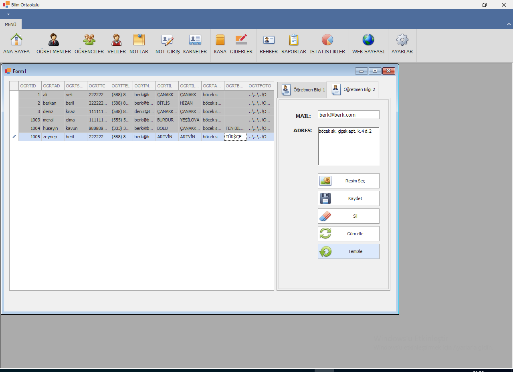

# OkulOtomasyonProjesi
Burada Okul Otomasyonu olan bir proje yer alıyor.Bu projede örnek olarak bir okul otomasyon sistemi tasarlanıp geliştirilmeye çalışılacak ve dökümantasyonu sağlanmaya çalışılacak.Proje C# dili ile ve önyüz tasarımı DevExpress ile yapılacak.

# AnaModul
AnaModul anasayfa gibi tüm bileşenleri üzerinde barındıyor ve tüm fonksiyonlar ana AnaModul üzerinden erişiliyor.
## Tasarim
Tasarım aşağıda görüldüğü gibi

## Veritabanı
Veri tabanı yapısı **DB_Script** dizininde daha ayrıntılı açıklanır.Burada belli başlı proje ilerlemeleri için notlar ve açıklamalar bulunur.
ilk aşama olarak database, öğretmenler tablosu ve düşük yetkili kullanıcı oluşturuldu.Oluşturulan kullanıcı ile bağlantı sağlandı ve öğretmenlerin verileri öğretmenler penceresindeki data source'e çekildi.Bunu yapmak için Solution üzerine yeni bir dev express windows form tempalate i oluşturuldu ve bu proje üzerinde oluşturulan Veritabanı class'ında veritabanı bağlantı ve kodları oluşturuldu.daha sonra öğretmenler modülüne bu proje referans olarak eklenerek Veritabanı sınıfının nesnelerine erişim sağlandı.Bu şekilde yapılmasının nedeni Devexpress .Net 4.8 versiyonunu kullanıyor diğer ve derleme için oluşturulan yeni class library leri .Net 6 ve 5 gibi sürümleri kullanıyor  devexpress in kullandığı sürümleri kullanmıyor.Derleme esnasında derlenen class library dll leri dev express windows formları ile çalışmıyor bunun için devexpress projeleri içerisinde onun beraber derlenecek ve derleme hatası vermeyecek bir çözüm bulmam gerekiyordu.Daha pratik kullanışlı yöntemler tabiki vardır.Bu Veritabani için gerekli kodlar oluşturulduktan sonra OgretmenlerModul üzerinden namaspace dahil edildi ve veritabanı nesnesi oluşturularak bu nesne üzerinden veritabanı bağlantısı yapılarak öğretmenler tablosundaki veriler çekilmiş oldu.

öğretmenler penceresi;

## Önyüz Programlama(View)
Önyüz verileri ve verilerin işlenme ve entegre işlemleri ile ilgili fonksiyonları barındırır.
### Öğretmenler Penceresi Grid View verileri
Öğretmenler penceresindeki GridView üzerindeki veriler, veri girişi yaptığımız  text kutularına çekildi.Bunun için View adında bir bir proje oluşturuldu ve proje içerisinde View.cs adında class sınıfı için dosya oluşturuldu.Bu dosya bizim uygulamamızın önyüz programlaması için yani view katmanı için kullacağımız metotları ve fonksiyonları içerecek bu yüzden OgretmenlerModulu içerisine referans olarak eklendi.Bu dosya içerisine tanımlanan sınıfın içerisinde GridViewSatir adında bir fonksiyon tanımlandı ve işlemler bu fonksiyonun içerisinde yapıldı.OgretmenlerModulu içerisinde bu sınıftan bir nesne türetildi bu nesne üzerinden GridViewSatir fonksiyonuna erişildi.OgretmenlerModul üzerindeki ihtiyacımız olan nesneler bu fonksiyona parametre olarak verilerek OgretmenlerModul üzerindeki nesnelerin değerleri bu fonksiyon ile tablo üzerindeki verileri giriş kutularına yani OgretmenlerModul üzerindeki nesnelerin içine aktardı.

### Resim Seç Butonu
FileDialog penceresinden bir resmin seçildiğinde belirtilen göreceli dizine kopyalanması sağlandı.Bu resim öğretmenlerin resmi profil resmi olmalıdır.

### Güncelle Butonu
Update butonu için Veritabanı fonksiyonu yazıldı ve update butonuna entegre edildi.

### Sil Butonu
Öğretmenler tablosundan kayıt silmek için Veritabanı fonksiyonu yazıldı ve entegre edildi.

